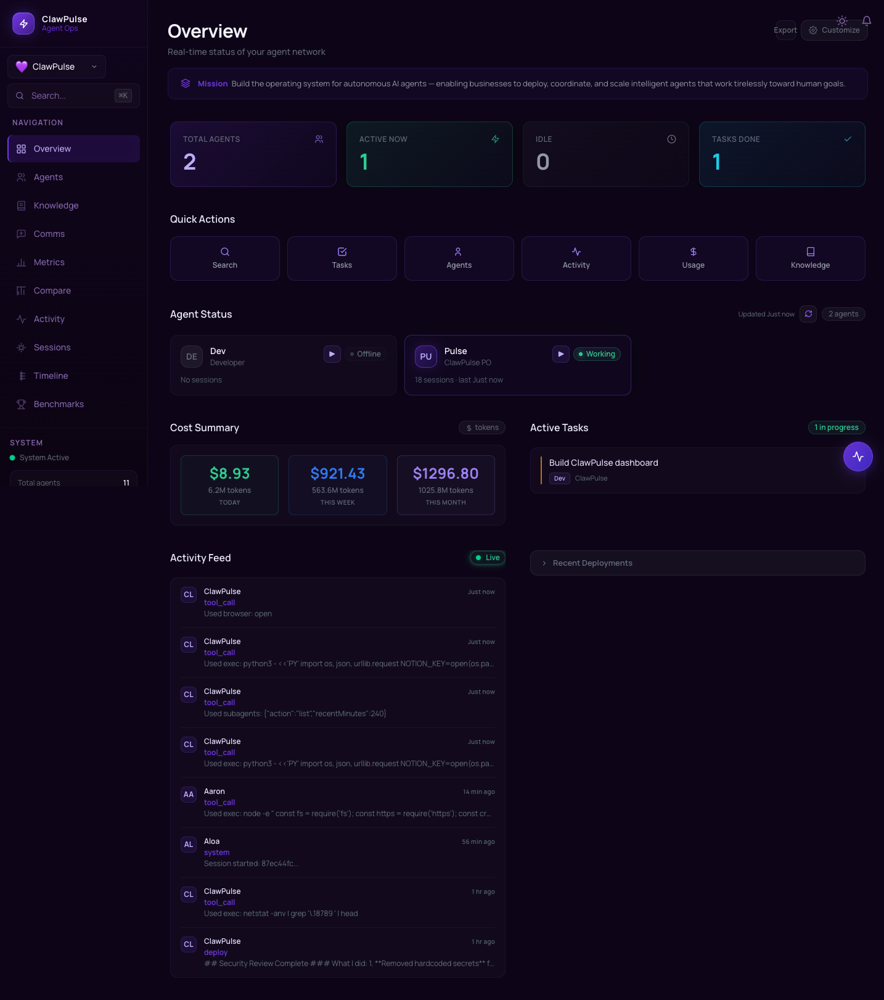
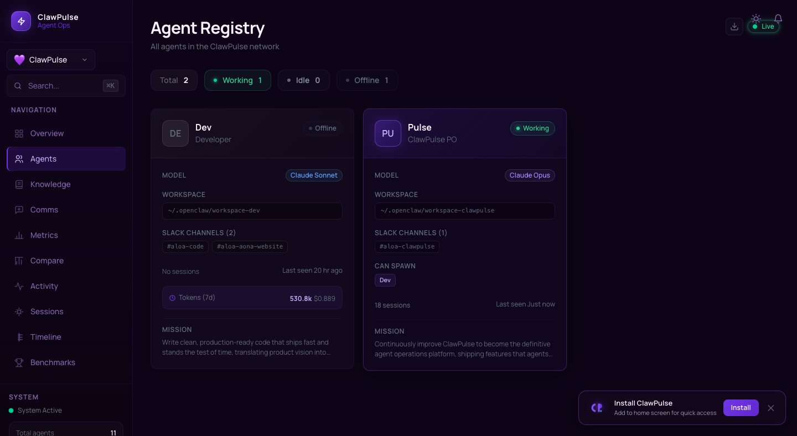
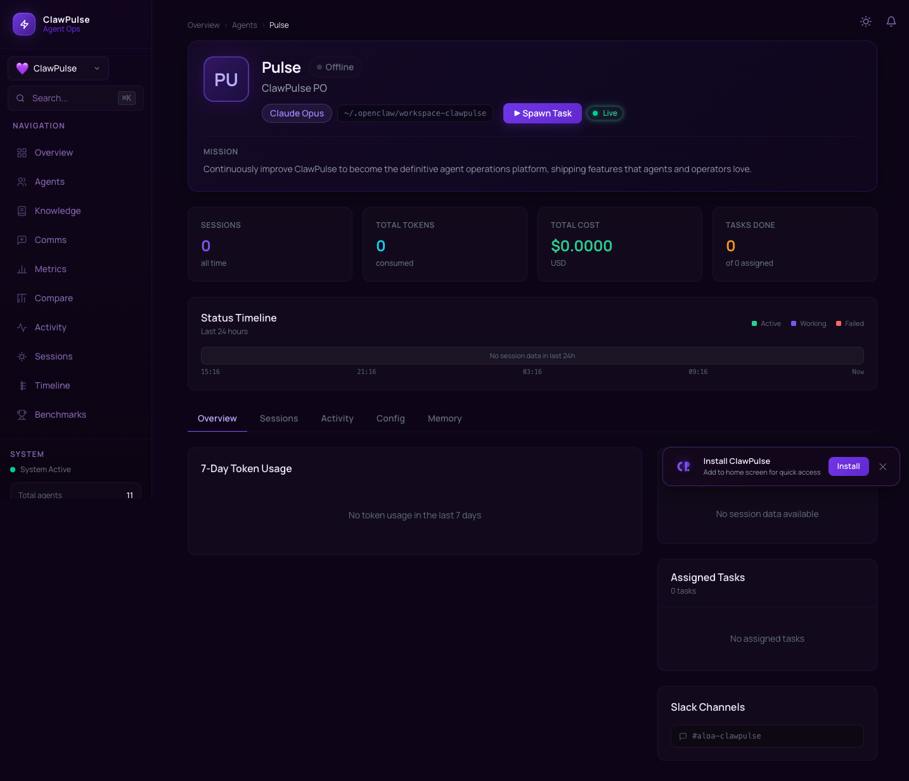
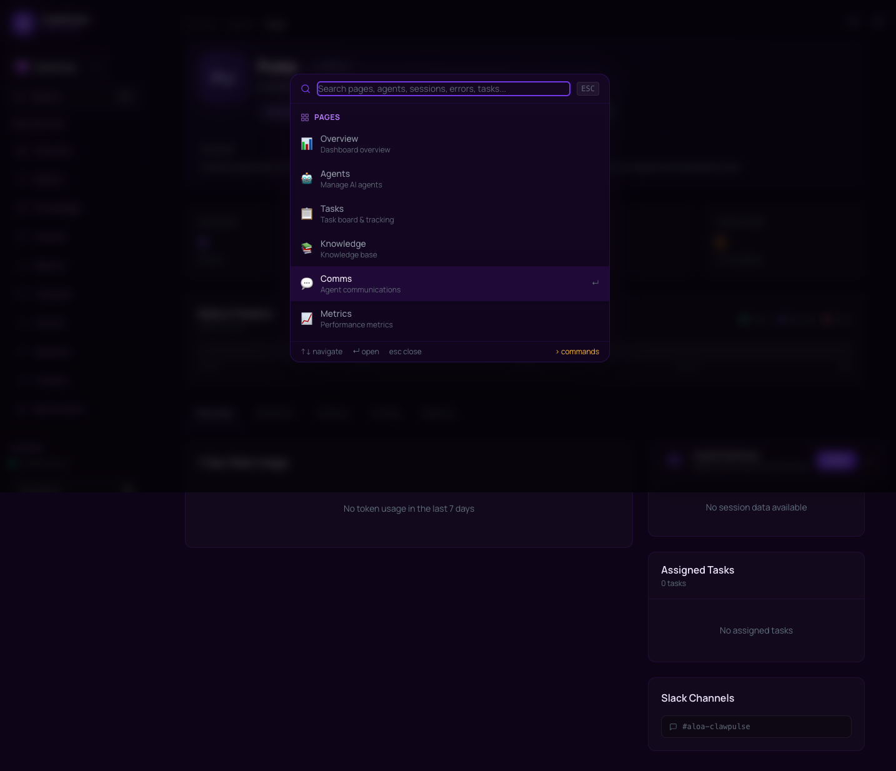
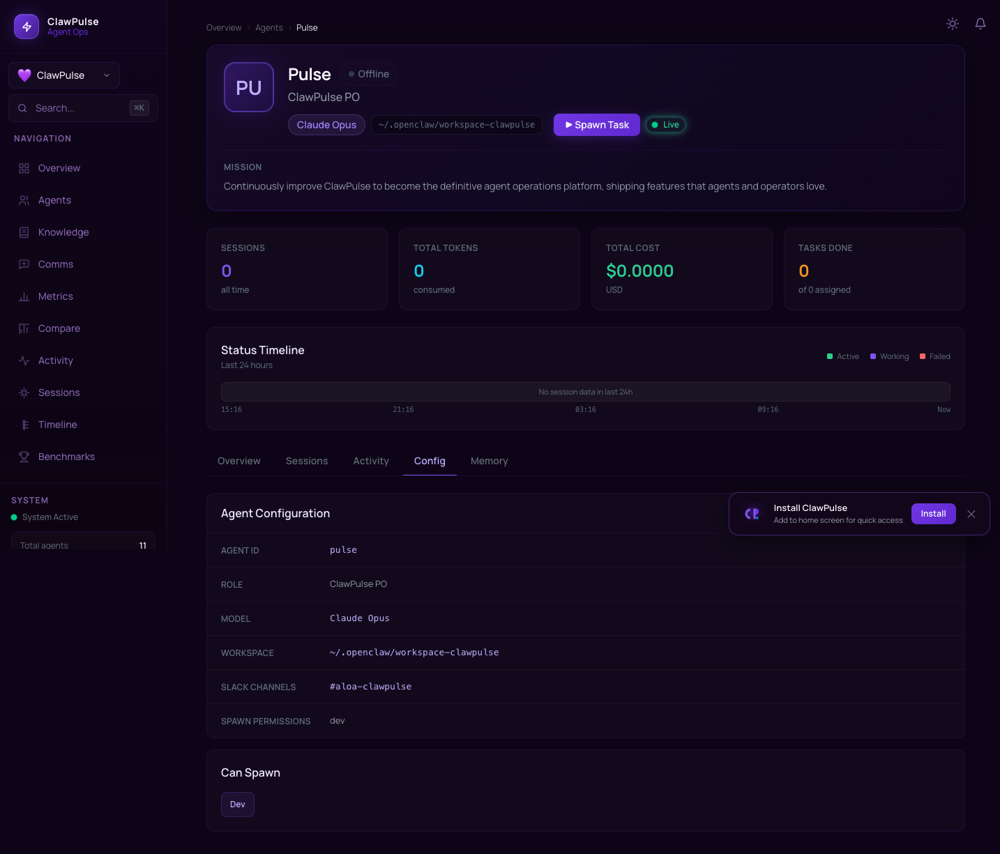

# 🔍 ClawPulse

**Agent Ops Dashboard** — Monitor, manage, and understand your AI agents in real time.

[](LICENSE)
[](https://nextjs.org/)
[](https://supabase.com/)
[](https://firebase.google.com/)
[](https://www.typescriptlang.org/)

---

ClawPulse is a comprehensive operations dashboard for AI agent systems. Track sessions, monitor errors, manage workflows, and gain full observability into your agent fleet — all from a single, real-time interface.

## ✨ Features

| Feature | Description |
|---------|-------------|
| **Agent Monitoring** | Live status, health checks, and activity feeds for all connected agents |
| **Session Tracking** | Full session history with timelines, durations, and detailed logs |
| **Error Tracking** | Centralized error collection with stack traces and resolution status |
| **Alerting** | Configurable alerts for agent failures, anomalies, and thresholds |
| **Workflows** | Visual workflow management for multi-step agent operations |
| **Knowledge Base** | Shared knowledge repository accessible by agents and operators |
| **Tasks** | Task assignment, tracking, and completion monitoring |
| **Comms** | Communication logs and message history across agent interactions |
| **Metrics** | Token usage, response times, success rates, and custom KPIs |
| **Mission / Vision / Goals** | Hierarchical objective tracking — mission → vision → goals |
| **Dark / Light Theme** | Full theme support with system preference detection |
| **PWA Support** | Install as a progressive web app on desktop and mobile |
| **Real-time Updates** | Live data via Supabase Realtime subscriptions |

## 📸 Screenshots

### Dashboard Overview
Real-time agent monitoring, metrics, and activity feed.



### Agent Registry
Browse and manage all agents in your network.



### Agent Detail
View comprehensive stats, configuration, and history for individual agents.



### Command Palette
Quick navigation and search with keyboard shortcuts (⌘K).



### Agent Configuration
Detailed configuration view for agent settings and permissions.



## 🚀 Quick Start

```bash
# Clone the repo
git clone https://github.com/yourusername/clawpulse.git
cd clawpulse

# Run setup (installs deps, copies env template)
chmod +x setup.sh
./setup.sh

# Edit your environment variables
nano .env.local

# Start development server
npm run dev
```

Open [http://localhost:3000](http://localhost:3000) to see your dashboard.

## 🏗 Architecture

```
┌─────────────────────────────────────────┐
│           Firebase Hosting              │
│         (Static Export / CDN)           │
├─────────────────────────────────────────┤
│         Next.js 14 (Static)            │
│     TypeScript · Tailwind CSS          │
├─────────────────────────────────────────┤
│              Supabase                   │
│   Postgres · Realtime · Auth · RLS     │
└─────────────────────────────────────────┘
```

- **Next.js 14** — Static site generation via `next export`
- **Supabase** — Postgres database with Row Level Security, Realtime subscriptions, and Auth
- **Firebase Hosting** — Global CDN for the static build output
- **TypeScript** — Full type safety across the codebase
- **Tailwind CSS** — Utility-first styling with dark mode support

## ⚙️ Configuration

Copy `.env.example` to `.env.local` and configure:

| Variable | Required | Description |
|----------|----------|-------------|
| `NEXT_PUBLIC_SUPABASE_URL` | ✅ | Your Supabase project URL |
| `NEXT_PUBLIC_SUPABASE_ANON_KEY` | ✅ | Your Supabase anonymous/public key |
| `NEXT_PUBLIC_APP_NAME` | ❌ | App display name (default: `ClawPulse`) |
| `NEXT_PUBLIC_COMPANY_NAME` | ❌ | Your company/org name |

## 🗄 Database Setup

ClawPulse uses Supabase (Postgres). To set up your database:

1. **Create a Supabase project** at [supabase.com](https://supabase.com)

2. **Run migrations** in order via the Supabase SQL Editor or CLI:

```bash
# Using Supabase CLI
supabase db push

# Or manually run each migration in supabase/migrations/
# 001_create_tables.sql
# 002_add_write_policies.sql
# 003_token_usage_settings_mission.sql
# ...through 013_mission_hierarchy.sql
```

3. **Copy your project URL and anon key** from Supabase → Settings → API into `.env.local`

## 🚢 Deployment

### Firebase Hosting

```bash
# Build the static export
npm run build

# Deploy to Firebase
firebase deploy --only hosting
```

The build outputs to `out/` which Firebase serves as a static site.

### First-time Firebase setup

```bash
npm install -g firebase-tools
firebase login
firebase init hosting  # select "out" as public dir, configure as SPA
```

## 🤝 Contributing

Contributions are welcome! Please:

1. Fork the repository
2. Create a feature branch (`git checkout -b feature/my-feature`)
3. Commit your changes (`git commit -m 'feat: add my feature'`)
4. Push to the branch (`git push origin feature/my-feature`)
5. Open a Pull Request

## 📄 License

[MIT](LICENSE) — use it however you like.
